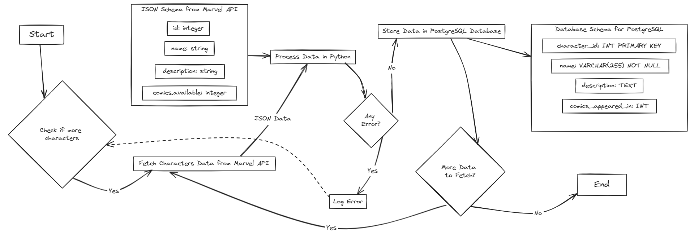

# Marvel Characters Data Loader

## Project Description
This project is a Python-based data loader that fetches Marvel characters data from the Marvel API and stores it in a PostgreSQL database. It utilizes Docker to ensure that the application is easily reproducible and portable across different environments.

## Prerequisites
Before you begin, ensure you have the following installed:
- Docker
- Docker Compose

## Setup Instructions

### Clone the Repository
Start by cloning this repository to your local machine:

`git clone https://github.com/osipovia/Marvel-API-data.git`

`cd Marvel-API-data`

### Environment Variables
Create a `.env` file in the root directory of the project and update it with your Marvel API keys and PostgreSQL database credentials. Refer to the `.env.example` file for the required format.

### Build and Run the Docker Containers
Run the following command to build and start the Docker containers:

`docker-compose up --build`

## Usage
Once the Docker containers are up and running, the script will automatically start fetching data from the Marvel API and inserting it into the PostgreSQL database.

